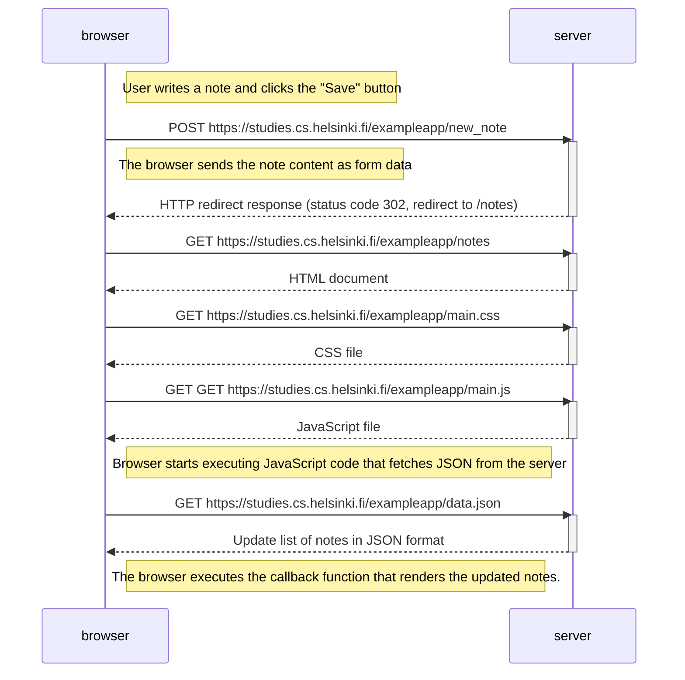

```mermaid
sequenceDiagram

participant browser
participant server

Note right of browser: User writes a note and clicks the "Save" button

browser->>server: POST https://studies.cs.helsinki.fi/exampleapp/new_note
activate server
Note right of browser: The browser sends the note content as form data
server-->>browser: HTTP redirect response (status code 302, redirect to /notes)
deactivate server

browser->>server: GET https://studies.cs.helsinki.fi/exampleapp/notes
activate server
server-->>browser: HTML document
deactivate server

browser->>server: GET https://studies.cs.helsinki.fi/exampleapp/main.css
activate server
server-->>browser: CSS file
deactivate server

browser->>server: GET GET https://studies.cs.helsinki.fi/exampleapp/main.js
activate server
server-->>browser: JavaScript file
deactivate server

Note right of browser: Browser starts executing JavaScript code that fetches JSON from the server

browser->>server: GET https://studies.cs.helsinki.fi/exampleapp/data.json
activate server
server-->>browser: Update list of notes in JSON format
deactivate server

Note right of browser: The browser executes the callback function that renders the updated notes.
```