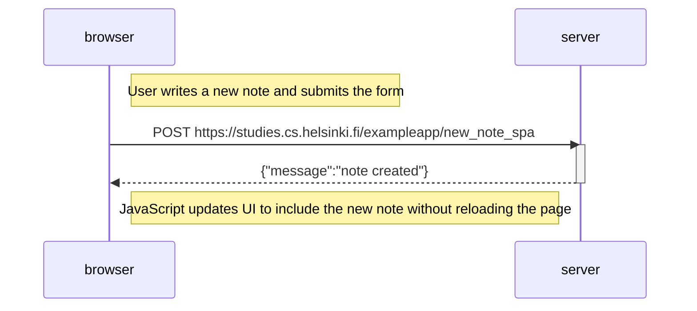

```mermaid
sequenceDiagram

participant browser
participant server

Note right of browser: User writes a new note and submits the form

browser->>server: POST https://studies.cs.helsinki.fi/exampleapp/new_note_spa
activate server
server-->>browser: {"message":"note created"}
deactivate server

Note right of browser: JavaScript updates UI to include the new note without reloading the page
```